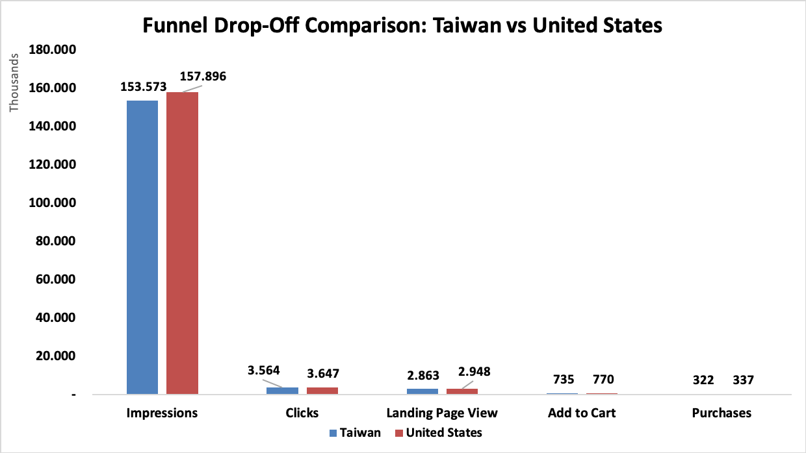
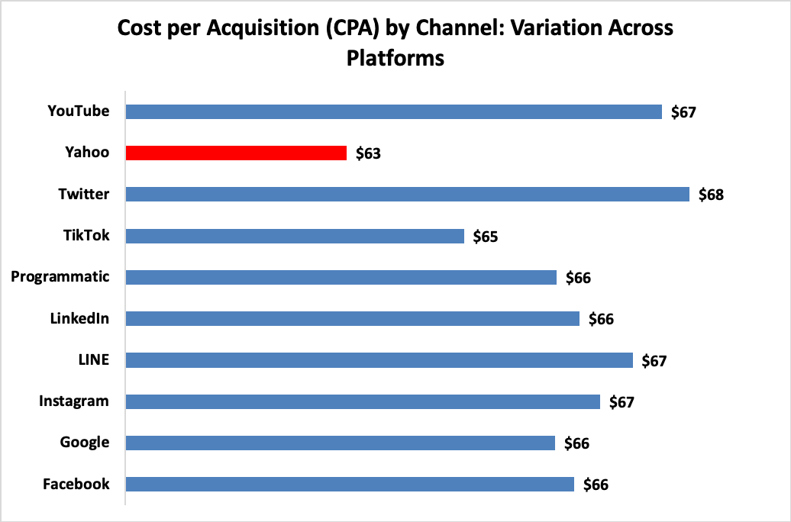
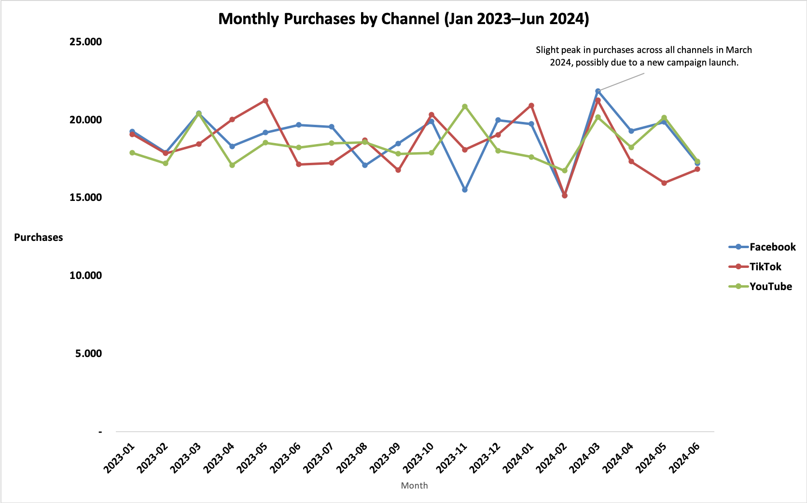

# Marketing Funnel Conversion Analysis

## Project Overview

This project analyzes a large digital marketing funnel dataset to pinpoint where ad spend produces results, identify funnel drop-off points, and highlight the most and least cost-effective segments. The work demonstrates advanced data cleaning, EDA, KPI calculation, segmentation, and actionable insights—ideal for marketing analytics roles.

---

## Dataset Description

- **Rows:** 43,000+ marketing campaign records  
- **Time Period:** January 2023 – June 2024  
- **Segments Tracked:** Channel, Country, Device, Ad Creative  
- **Funnel Steps:** Impressions → Clicks → Landing Page Views → Add to Cart → Purchases  
- **Monetary Columns:** Spend (USD), Revenue (USD)

---

## Process Summary

All steps are contained in one Excel file, each as a separate sheet:

- **EDA & Funnel Summary:** Totals, averages, medians, and funnel conversion rates with drop-off chart
- **Channel KPI Breakdown:** Channel KPI analysis (CPA, ROAS by Channel)
- **Device KPI Breakdown:** Device KPI analysis
- **Country KPI Breakdown:** Country KPI analysis (including outlier notes)
- **Ad Creative KPI Breakdown:** Ad Creative KPI analysis
- **Funnel Comparison by Segment:** Funnel drop-off visualized by Country & Channel
- **Trend Over Time:** Monthly trend analysis (by Channel)
- **Segment & Trend Analysis:** High/low performing segments, trend commentary, outlier review
- **Insights & Recommendations:** Clear, actionable takeaways
- **Issue Log:** Full documentation of data cleaning challenges and fixes

---

## Sample Visuals

*(Screenshots/charts from your file, swap in your own if desired)*

| Funnel Drop-off | Channel KPI | Trend Over Time |
|---|---|---|
|  |  |  |

---

## Key Insights

- **Impressions-to-Clicks** is the main point of user drop-off; creative and targeting should be improved to capture more clicks.
- **All channels deliver similar ROAS (~0.3x), but YouTube achieves the lowest CPA**, making it the most cost-efficient.
- **US and Taiwan are top purchase markets.** Indonesia shows extremely high ROAS but only due to low spend—likely not repeatable.
- **Mobile devices drive the most purchases,** but desktop CPA is slightly lower, so both have optimization potential.
- **No clear seasonality detected**; March 2024 saw a small spike (likely campaign-driven).

---

## Recommendations

1. **Shift budget toward YouTube** to capitalize on its low cost-per-acquisition.
2. **Test new creatives and improve targeting** to reduce early funnel drop-off.
3. **Monitor high-ROAS countries for repeatability**—outliers may not scale.
4. **Continue to focus on mobile for scale,** but invest in desktop for efficiency.

---

## File Structure

```text
/project-root/
├── Marketing_Funnel_Conversion_Analysis.xlsx  # All analysis in one file (multiple sheets)
├── Report.pdf
├── README.md
